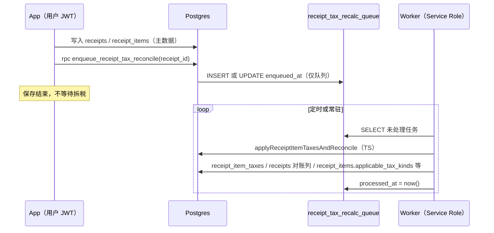

# 小票拆税异步流水线（接续说明）

本文说明 **保存小票** 与 **行级拆税 / 对账** 在架构上如何分开，以及运维上要做什么。后续改拆税逻辑、上 Edge/Cron 时，以本文件 + `receipt-item-tax.ts` 为准。

---

## 一句话

**App 只负责把「这张小票需要算税」写进队列；真正写 `receipt_item_taxes`、更新对账字段，要由带 Service Role 的后台进程（worker）去做。**  
若不跑 worker，**小票和行项照常能保存**，但 **行税明细和对账状态可能不会更新**（或一直停留在旧结果）。

---

## 以前 vs 现在（为什么有「运维注意点」）

| 阶段 | 以前 | 现在 |
|------|------|------|
| 用户保存小票 | 同一进程里 `queueMicrotask` 调 `applyReceiptItemTaxesAndReconcile`（在用户手机/浏览器里跑） | 同一进程里只调 `enqueue_receipt_tax_reconcile`（一次 RPC，只插入/刷新队列行） |
| 拆税写库 | 立刻在用户设备上执行（CRM 查询、写 `receipt_item_taxes` 等） | **不在 App 里执行**；由 **单独部署的 worker** 用 **Service Role** 执行 `applyReceiptItemTaxesAndReconcile` |

所以「运维注意点」的意思是：**拆税不再随 App 自动发生**；你们需要在 **服务器、CI、或本机长期跑的进程** 上配置 worker，否则队列里的任务没人消费。

---

## 数据流（简图）

---

## 涉及对象（接续开发时从这里找）

| 类型 | 路径 / 名称 |
|------|-------------|
| 迁移（队列表 + 入队 RPC） | `vouchap-app/supabase/migrations/20260418150000_receipt_tax_recalc_queue.sql` |
| App 侧仅入队 | `vouchap-app/src/shared-logic/receipt-tax-queue-client.ts` |
| 保存小票后触发入队 | `vouchap-app/src/shared-logic/database.ts`（`enqueueReceiptTaxReconcileFireAndForget`） |
| 拆税与对账逻辑（未改业务算法时仍在这里） | `vouchap-app/src/shared-logic/receipt-item-tax.ts`（`applyReceiptItemTaxesAndReconcile`、`scheduleReceiptTaxRecalcIfNeeded`） |
| 后台 worker 脚本 | `vouchap-app/scripts/receipt-tax-queue-worker.ts` |
| npm 脚本 | `vouchap-app/package.json`：`receipt-tax-worker`、`receipt-tax-worker:once` |

**表：** `public.receipt_tax_recalc_queue`（`receipt_id`, `space_id`, `enqueued_at`, `processed_at`, `last_error`, `attempts`）。

**RPC：** `public.enqueue_receipt_tax_reconcile(p_receipt_id uuid)` — 校验当前用户是否在该小票所属 `space` 的 `user_spaces` 中。

---

## 运维要做什么（可操作清单）

1. **部署迁移**  
   在 Supabase 上执行包含 `20260418150000_receipt_tax_recalc_queue.sql` 的迁移，否则 App 调 `enqueue_receipt_tax_reconcile` 会失败（控制台会有 `[receipt-tax-queue] enqueue rpc failed`）。**主数据写入不依赖该 RPC 成功与否时**——若 RPC 失败，只是**没人排队**，需看产品是否要在 UI 提示。

2. **配置环境变量（仅 worker 机器）**  
   - `SUPABASE_URL`  
   - `SUPABASE_SERVICE_ROLE_KEY`（**勿**打进 App 包，仅 worker/CI 使用）

3. **跑 worker（二选一或组合）**  
   - **常驻：** 在 `vouchap-app` 目录执行  
     `npm run receipt-tax-worker`  
   - **定时：** 每分钟（或每 5 分钟）执行一次  
     `npm run receipt-tax-worker:once`  
     （cron、GitHub Actions、K8s CronJob 等均可）

4. **观察队列（排障）**  
   - 若 `processed_at` 长期为空、`attempts` 上升：看 `last_error`，多为 CRM 不可见、RLS、或 `receipt-item-tax` 内异常。  
   - worker 日志：`[receipt-tax-worker] ok <receipt_id>` / `failed ...`

---

## 与「删 `receipt_items.tax_class_code`」的关系

行上 **`tax_class_code`** 已移除；拆税用的供应类仍来自 **POS/实体规则 + 默认 STANDARD_TAXABLE**（见 `receipt-item-tax.ts`）。  
队列方案与删列 **独立**：队列只保存 `receipt_id` / `space_id`，不依赖已删列。

---

## 后续可演进方向（备忘）

- **Supabase Edge Function + Scheduler**：定时 HTTP 触发，内部调用与 worker 相同的逻辑（需解决 Deno 与 `receipt-item-tax` 的打包/复用，或保留 Node worker 由 Edge 仅做「唤醒」）。  
- **`pg_cron` + `pg_net`**：定时 POST 到自建 worker URL。  
- **入队幂等 / 优先级**：当前「同 receipt 未处理则 bump `enqueued_at`」已做合并；若以后要「强制重算」可再加字段或单独 RPC。  
- **失败重试策略**：`receipt-tax-queue-worker.ts` 内 `MAX_ATTEMPTS`、放弃后写 `last_error`，可按产品调整。

---

## 迁移 / SQL 执行器注意

若使用 **按分号拆分** 的 SQL 工具执行迁移，**`LANGUAGE plpgsql`** 且带 `DECLARE` 的函数可能被切成多段，未定义变量会被当成表名并报 **`42P01: relation "…" does not exist`**。当前仓库中的 **`enqueue_receipt_tax_reconcile`** 已改为 **`LANGUAGE sql` 单条语句**（`WITH … INSERT … ON CONFLICT`），并依赖部分唯一索引 **`receipt_tax_recalc_queue_pending_receipt_uniq`**。校验失败时表现为 **除零错误**（非逐条 RAISE 文案）；若需友好报错可后续包一层薄 plpgsql 仅调该 SQL。

## 溯源

工程对话全量仍写在 `docs/PRD-SOURCE-LOG.md`；本文件为 **拆税异步流水线** 的结构化接续说明，便于 PRD/实现分工时引用。
